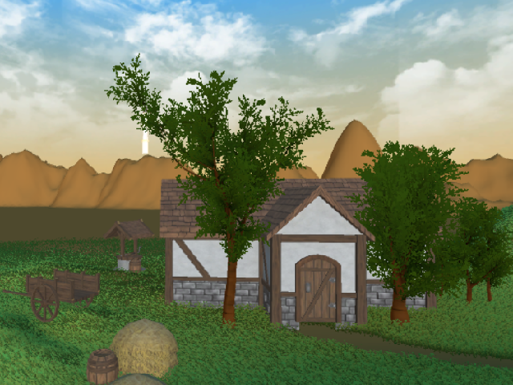

# We are *Catch These Hands*

*Catch These Hands* is a hackathon project for [SF Hacks
2017](https://sfhacks.io), created by a team of student developers. Over the
course of > 24 hours, we created an immersive virtual experience with support
for controller free user interaction using a hand motion sensor.

## Hardware

We created the project using the Unity game engine, building onto a consumer
model Oculus Rift virtual reality (VR) headset borrowed from **MLH**. We
modified the VR headset (seen below) to track hand motions by mounting a Leap
Motion (also **MLH**) sensor to the front of the device.

Here is a front view of the Oculus VR with Leap Motion sensor

The placement of the sensor necessitates that the user is staring at their hands
while operating them. This is a hardware issue, but is normal user behavior.

To complete our completely professional hardware mod, we relied on Duck Tape
(also **MLH**).

## Software

Aerial view of our map, created with free assets found on the Unity store but
customized and laid out by our team (not as easy as it sounds).

Our original idea for the interactive game mechanic was to have the user grab an
axe and cut down trees. After realizing that the physics behind making the tree
"fall" was not feasible, we pivoted to having players move boxes scattered
throughout the map.

The final version of our project can be opened in Unity with the folder `Roll a
ball Game version 2.0`. This name comes from the original Unity tutorial on
rolling a ball, although ironically after the latest release added a large ball
in addition to the boxes to interact with, the name is once again relevant.

## The Team

We are 4 students (3 college, 1 high school) from various parts of the United
States (San Francisco Bay Area, Central Coast, and Florida) who met at this
event.

- Conor Forgey (@conorforgey)
- Brandon Taylor (@Brando-Commando)
- Russell Villanueva (@villanuevarussell)
- August Valera (@4U6U57)
